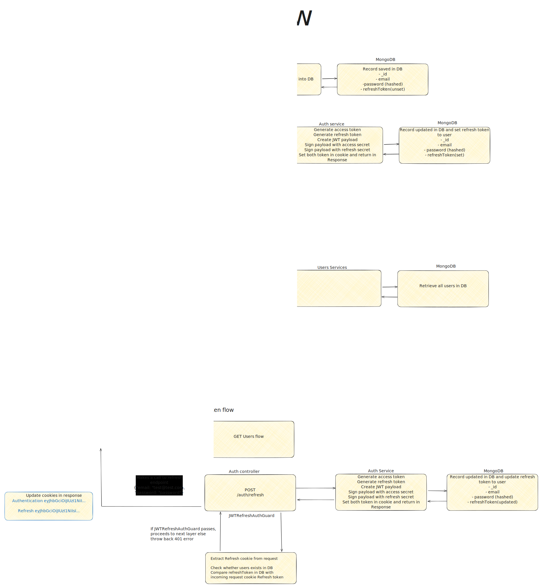

<p align="center">
  <a href="http://nestjs.com/" target="blank"></a>
</p>

[circleci-image]: https://img.shields.io/circleci/build/github/nestjs/nest/master?token=abc123def456
[circleci-url]: https://circleci.com/gh/nestjs/nest

  <p align="center">A progressive <a href="http://nodejs.org" target="_blank">Node.js</a> framework for building efficient and scalable server-side applications.</p>
    <p align="center">
<a href="https://www.npmjs.com/~nestjscore" target="_blank"></a>
<a href="https://www.npmjs.com/~nestjscore" target="_blank"></a>
<a href="https://www.npmjs.com/~nestjscore" target="_blank"></a>
<a href="https://circleci.com/gh/nestjs/nest" target="_blank"></a>
<a href="https://coveralls.io/github/nestjs/nest?branch=master" target="_blank"></a>
<a href="https://discord.gg/G7Qnnhy" target="_blank"></a>
<a href="https://opencollective.com/nest#backer" target="_blank"></a>
<a href="https://opencollective.com/nest#sponsor" target="_blank"></a>
  <a href="https://paypal.me/kamilmysliwiec" target="_blank"></a>
    <a href="https://opencollective.com/nest#sponsor"  target="_blank"></a>
  <a href="https://twitter.com/nestframework" target="_blank"></a>
</p>
  <!--[](https://opencollective.com/nest#backer)
  [](https://opencollective.com/nest#sponsor)-->

## Project Description

[Nest](https://github.com/nestjs/nest) framework TypeScript starter repository.

### Libraries utilised

- passport
- mongoose (ORM for mongo)
- mongodb
- bcryptjs
- passport-google-oauth20

### JWT auth flows covered

- Login flow with local strategy
- Get users flow with JWT auth strategy
- Refresh token flow with JWT refresh token strategy
- OAuth Google login

### Storing JWT token in response cookies

Storing JWT (JSON Web Tokens) in response cookies is considered a best practice for several reasons related to security, usability, and compliance:

1. **Security Against XSS**: Cookies are less susceptible to Cross-Site Scripting (XSS) attacks compared to local storage or session storage. This is especially true when using HTTP-only cookies, which are not accessible via JavaScript.

2. **SameSite Attribute**: Cookies can be configured with the `SameSite` attribute, which helps protect against Cross-Site Request Forgery (CSRF) attacks by restricting how cookies are sent with cross-site requests.

3. **Automatic Handling**: When cookies are used, they are automatically included in requests to the same domain. This simplifies the client-side code, as there's no need to manually add the token to request headers.

4. **Secure Attribute**: By setting the `Secure` attribute, you ensure that cookies are only sent over HTTPS, adding an extra layer of security in transit.

5. **Compliance and Standards**: Using cookies can help align with certain regulatory requirements and security standards that dictate secure handling of session information.

6. **Domain and Path Scoping**: Cookies can be scoped to specific paths or subdomains, reducing the risk of leakage to unintended parts of your application.

7. **Storage Limitations**: While cookies have size limitations, they are typically sufficient for storing JWTs, and using cookies avoids the potential pitfalls of reaching storage quotas in local or session storage.

Overall, using cookies for storing JWTs leverages browser-provided security features, offering a more secure and standardized approach to token management in web applications. However, it's crucial to implement these cookies with the correct security flags (e.g., `HttpOnly`, `Secure`, `SameSite`) to maximize their protective benefits.

### Diagram



### Endpoints

#### POST /users - create users

```
curl --request POST \
  --url http://localhost:3000/users \
  --header 'Content-Type: application/json' \
  --header 'User-Agent: insomnia/9.3.3' \
  --data '{
  "email": "david@test.com",
  "password": "SomeTestPassword123:@"
}'
```

#### POST /auth/login

```
curl --request POST \
  --url http://localhost:3000/auth/login \
  --header 'Content-Type: application/json' \
  --data '{
	"email": "david@test.com",
	"password": "SomeTestPassword123:@"
}'
```

#### GET /users - get all users(ensure cookies are already set)

```
curl --request GET \
  --url http://localhost:3000/users \

```

#### POST /auth/refresh - get new access token utilising refresh tokens upon expiration of access token

```
curl --request POST \
  --url http://localhost:3000/auth/refresh \
  --header 'Content-Type: application/json' \
  --data '{
	"email": "david@test.com",
	"password": "SomeTestPassword123:@"
}'

```

## Project setup

```bash
$ pnpm install

# run mongo
$ docker-compose up

# cp .env.example to .env
# populate <DB_NAME>, <YOUR_SECRET>, <CLIENT_ID>, <CLIENT_SECRET> with your own values
# access token default expiry - 3600000ms (1hour)
# refresh token default expiry - 604800000ms (7 days)
$ cp .env.example .env

```

## Compile and run the project

```bash
# development
$ pnpm run start

# watch mode
$ pnpm run start:dev

# production mode
$ pnpm run start:prod
```

## Run tests

```bash
# unit tests
$ pnpm run test

# e2e tests
$ pnpm run test:e2e

# test coverage
$ pnpm run test:cov
```

## Resources

Check out a few resources that may come in handy when working with NestJS:

- Visit the [NestJS Documentation](https://docs.nestjs.com) to learn more about the framework.
- For questions and support, please visit our [Discord channel](https://discord.gg/G7Qnnhy).
- To dive deeper and get more hands-on experience, check out our official video [courses](https://courses.nestjs.com/).
- Visualize your application graph and interact with the NestJS application in real-time using [NestJS Devtools](https://devtools.nestjs.com).
- Need help with your project (part-time to full-time)? Check out our official [enterprise support](https://enterprise.nestjs.com).
- To stay in the loop and get updates, follow us on [X](https://x.com/nestframework) and [LinkedIn](https://linkedin.com/company/nestjs).
- Looking for a job, or have a job to offer? Check out our official [Jobs board](https://jobs.nestjs.com).

## Support

Nest is an MIT-licensed open source project. It can grow thanks to the sponsors and support by the amazing backers. If you'd like to join them, please [read more here](https://docs.nestjs.com/support).

## Stay in touch

- Author - [Kamil Myśliwiec](https://twitter.com/kammysliwiec)
- Website - [https://nestjs.com](https://nestjs.com/)
- Twitter - [@nestframework](https://twitter.com/nestframework)

## License

Nest is [MIT licensed](https://github.com/nestjs/nest/blob/master/LICENSE).
